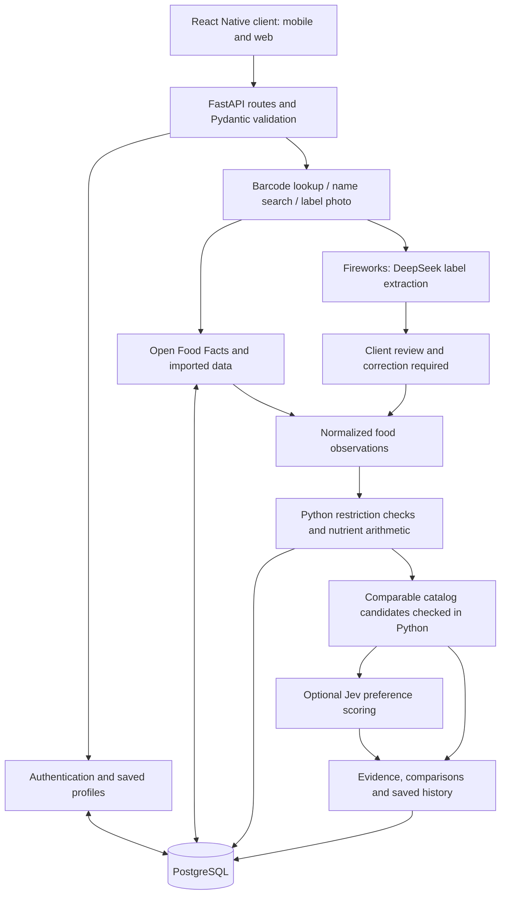

# Backend mentoring script

> Status: current walkthrough (refreshed 2026-09-26). Current code-verified behaviour lives in [`../backend/README.md`](../backend/README.md).

Prepared from the current code on 26 September 2026. Main talk: approximately 15 minutes; the tables and Q&A are reference notes.

## Read this before presenting

This describes the backend implementation, not a claim that the complete clinical product is finished. PostgreSQL migrations and the IFCT importer have run; the importer reported 542 records on both runs. The backend suite is 60+ tests and passes, including the earlier Fireworks and allergen-tag additions. The Docker image builds, and the real-PostgreSQL HTTP smoke path runs (see `../backend/scripts/runtime-api-smoke.md`). Authenticated live Fireworks and Jev inference were verified on 2026-09-26 with the configured keys; evidence and the opt-in repeat command are in `../backend/scripts/provider-live-verification.md`. That check covers connectivity and output shape, not reading accuracy on real packaging.

There is **no standalone OCR library** in this backend. Pillow checks images; it does not read their text. The implemented label-reading path sends a photograph to DeepSeek V4.1 Flash through Fireworks. The barcode camera and the label-photo review screen are both wired in the React Native frontend; they are no longer outstanding.

## 1. Opening

“Our project translates a person's recorded dietary restrictions into checks on actual food information. A user saves their conditions, allergies, ingredient exclusions and optional clinician-provided nutrient limits. They can then find a packaged product, inspect the available evidence, understand relevant concerns and request comparable alternatives.

The backend has three responsibilities: acquire and normalize food observations, evaluate the recorded profile against those observations, and suggest replacements that pass the same checks. We use AI for reading labels and understanding flavor preferences. The final restriction checks and nutrient calculations run in Python.”

## 2. Architecture

“We use a single modular FastAPI application written in Python 3.12. Our React Native app will call this backend over HTTP and receive JSON responses. Both native and browser clients use the same API.

Inside the backend, route modules handle accounts, profiles, products, label extraction, assessments and recommendations. Pydantic validates incoming data. Service modules contain the assessment and replacement logic. Separate adapters communicate with Open Food Facts, Apify, Fireworks and TypeSafe.

PostgreSQL stores application records. SQLAlchemy is our ORM, psycopg is the PostgreSQL driver, and Alembic manages schema migrations. HTTPX performs external HTTP requests asynchronously. Uvicorn runs the FastAPI application.

We chose one service for the hackathon because it lets us complete and debug the whole journey without introducing communication between multiple backend services.”

## 3. Sign-in and personalization

“When someone registers, we validate the email and password, hash the password using Argon2 through pwdlib, and save the hash. We never store the original password.

Login returns a signed JWT containing the user ID, issue time, expiry, issuer and audience. The client passes that token in the Authorization header. The backend checks its signature and expiry and loads the user before handling a personal request. The default token lifetime is 30 minutes.

Each user currently has one saved profile. It contains condition names, supported allergies, explicit ingredient exclusions, optional nutrient limits, comparison goals and preferences.

A limit records its nutrient, maximum, whether it applies per portion or per day, and the source supplied by the user. This source is recorded context; the prototype does not authenticate a clinician's prescription. A comparison goal, such as lower sodium, is stored separately from a maximum.

Profiles are versioned. If a person edits their profile after an assessment, we require a new assessment before generating replacements. This prevents a result created under old restrictions being presented as applicable to the updated profile.”

## 4. Barcode scanning and product search

“The phone camera will decode an EAN or UPC barcode on the device. It sends the resulting numeric string to the backend. The backend does not perform camera decoding or use an LLM to recognize barcodes.

We have GET /api/products/barcode/{barcode}. It validates the barcode length, checks our PostgreSQL catalog, and returns a saved observation if present. Otherwise, it requests the Open Food Facts product endpoint and stores the raw response and its normalized observation. A refresh option requests an updated source record.

Our unified GET /api/products/search endpoint also accepts a query. If it looks like a supported barcode, it follows the same lookup path. For a product name or brand, it searches the saved catalog using case-insensitive SQL matching. When include_live is true, it also requests Open Food Facts search and combines the results.

This search currently uses SQL matching and external product search. It does not use embeddings or an LLM. If live name search fails, saved results remain available. If a barcode has no record, we ask for a label photo or manual entry.

A barcode identifies a candidate product; it does not prove that every ingredient or nutrient field is complete. The user still needs to confirm the physical pack and variant.”

## 5. Data sources and normalization

“We use different datasets for different purposes.

Open Food Facts provides packaged-product records. We preserve its original data, normalize supported nutrients and store provenance and warnings. Missing values remain null, so missing sodium is different from zero sodium.

For example, Open Food Facts stores normalized sodium quantities in grams. Our adapter converts those values to milligrams in Python. We also reject physically implausible values. In the supplied Bhujia record, the sodium amount was an outlier; we preserve the original but keep that assessment value unknown rather than guess a corrected unit.

The supplied Apify Open Food Facts run has an existing dataset that our importer can read. Its flattened output lacks reliable nutrient unit and basis information. Those amounts remain unknown until they can be checked against a suitable original record or pack. We do not launch a new paid scraper run during source verification.

IFCT 2017 is an ingredient composition reference. We wrote a CSV importer rather than installing its JavaScript package as a Python dependency. It loads the food records and the dataset's representation metadata. The import has reported 542 foods, and running it again updates records by their food code.

The unit conversion uses that metadata. For example, a raw sodium value of 0.0027 with a factor of 1000 becomes 2.7 milligrams. Energy in kilojoules becomes kilocalories by division by 4.184. Available carbohydrate and free sugars retain their separate meanings; we do not rename them as total carbohydrate or total sugars.

IFCT can support future ingredient or recipe calculations when quantities and preparation are known. It cannot establish the nutrition of a branded biscuit or an unspecified cooked dish. Its repository license and source-book rights also need consideration before redistribution.

Food.com recipe imports currently stage raw recipe records for review. Actual recipe output and nutrition derivation have not been validated. Barcode List is a researched candidate-identification source, not an implemented nutrition API.”

## 6. Label reading: where DeepSeek is used

“For label photos, we use a multimodal model: DeepSeek V4.1 Flash hosted on Fireworks. The configured model ID is accounts/fireworks/models/deepseek-v4p1-flash. Fireworks documents image input for this model. [Fireworks model page](https://fireworks.ai/models/deepseek-ai/deepseek-v4p1-flash)

There is no separate Tesseract, EasyOCR or PaddleOCR stage. The model performs image-to-structured-data extraction directly. Calling this multimodal label extraction is more precise than claiming we use a dedicated OCR engine.

The authenticated POST /api/labels/extract endpoint accepts JPEG or PNG files. We limit uploads to five megabytes and twenty million pixels. Pillow verifies the image format and integrity.

The backend sends the image as base64 content to Fireworks' chat-completions API. We provide a JSON schema describing the expected result: food name, ingredient text, advisory text, nutrition basis and visible nutrient measurements. Structured output constrains the response format; it does not prove the extracted observations are correct. [Fireworks structured outputs](https://docs.fireworks.ai/structured-responses/structured-response-formatting)

The prompt asks the model to copy observations, preserve missing information as null and treat image text as data rather than instructions. It copies each nutrient value with its original unit. Python then converts units and checks physical bounds. If only serving values are visible, we do not invent a per-100-gram value.

The endpoint returns confirmation_required: true. Ingredient and advisory completeness remain false until the user explicitly confirms the observations. The review screen that collects that confirmation is implemented in the frontend.

The model adapter has a 45-second default timeout. Authentication errors, unusable JSON, truncated output or timeouts return an extraction failure with a manual-entry path. These error paths are implemented, and live inference was verified on 2026-09-26 (see `../backend/scripts/provider-live-verification.md`).”

## 7. Ingredient matching and dietary assessment

“Our current matching system is a transparent rule-based text processor. It uses regular expressions with word boundaries and a curated alias dictionary. There is no trained NLP model or LLM deciding the restriction matches.

For a recorded wheat allergy, aliases include wheat, maida, atta and semolina. For milk, aliases include whey and casein. We handle examples such as eggplant so it does not match egg, and distinguish the word milk in almond milk from a dairy declaration. This remains a limited dictionary that needs further evaluation, especially for regional languages and unfamiliar ingredients.

We separate declared ingredients from precautionary statements such as may contain. Both can produce a concern, but we explain their different evidence. Source allergen tags with unclear classification remain separately identified.

An unspecified spice mix or flavoring does not reveal its full composition. We mark relevant uncertainty. We cannot discover an allergen that is absent from all available evidence.

For nutrients, Python checks that units and basis are known. Given an amount per 100 grams and a portion of 30 grams, the portion amount is the per-100-gram value multiplied by 30 divided by 100. A recorded per-portion maximum can produce a conflict. A daily maximum produces a contribution percentage; the app does not yet track the person's entire daily intake or calculate a remaining allowance.

We return three states: recorded_conflict, needs_information, or no_matching_concern_found. We retain missing-information findings even when a known conflict is present. No matching concern found means no concern was identified under these recorded checks; it is not universal clearance.

Our active awareness content covers diabetes-related carbohydrate review, hypertension-related sodium review and individually supplied CKD limits. We can store other conditions and check explicit restrictions, but unsupported condition guidance is clearly marked. We do not currently have a validated diet engine for every illness.”

## 8. Replacement suggestions

“We retrieve up to 100 saved products in the original product's confirmed category and evaluate them in Python.

A candidate must have the same category and a compatible nutrition basis. It must pass the profile's supported required checks without unresolved relevant information. For each recorded comparison goal, the needed nutrient amounts must be known. We reject a product that worsens another recorded goal.

A replacement must establish a supported improvement, such as lower sodium, or remove an original recorded conflict. We order candidates by nutrient values in the user's goal order and return up to five with comparison evidence.

For example, a synthetic cracker with 200 milligrams of sodium per 100 grams improves on one with 800. If it contains the user's recorded milk allergen, it is excluded before ranking.

If the catalog has no eligible replacement, we say so and preserve the checks. We do not ask an LLM to invent a product or silently relax a restriction.”

## 9. How Jev is used

“Jev is our optional preference decision model. TypeSafe accepts state and typed questions and provides structured answers. Its documented primitives include Choice, Score and Noul. Our current implementation uses Score only. [TypeSafe introduction](https://docs.typesafe.ai/introduction)

After Python has established eligibility and nutrient ordering, we send at most five candidate descriptions plus the user's preference, such as plain or mild crackers. We use model jev-1.13.0 through HTTPX at POST https://api.typesafe.ai/v1/systemone; the adapter does not import the TypeSafe SDK.

We ask one Score question per candidate using three rubric levels: conflicts with the preference, partial match or insufficient description, and clear preference match. The adapter validates question IDs, answer types, score range, probability distribution and confidence. Our demo threshold is 0.7; it is an application choice, not a medical accuracy guarantee.

Jev can reorder only candidates tied on the checked nutrient comparison values. It cannot bring back an excluded product, alter a nutrient amount or replace the Python assessment.

The optional request has a five-second total budget. Missing credentials, low confidence, malformed output or provider failure keep the deterministic order. We send candidate descriptions and preference text, not dedicated identity or condition fields. Preference text is user supplied and should not contain unrelated sensitive information.

This gives us a small semantic feature without making external inference a prerequisite for the core recommendation logic. Authenticated live Jev inference was verified on 2026-09-26 (see `../backend/scripts/provider-live-verification.md`).”

## 10. Storage, traceability and deployment

“We have seven main tables: users, profiles, products, assessments, recommendation_runs, reference_foods and recipe_records.

Relational columns support identity, ownership, unique barcodes and lookups. PostgreSQL JSONB stores flexible structured records such as profile data, original observations, source payloads and findings. Each assessment saves the profile version and snapshots of the profile and food observations. Findings record a rule version; model-assisted observations and rankings record their model or rubric metadata.

Personal routes enforce ownership. A user cannot read another person's assessment simply by knowing its ID. SQLAlchemy handles parameterized queries and transactions. For recommendation inference, we release the database transaction before waiting for Jev, then recheck the profile version before saving the result.

We use uv for the virtual environment, dependency installation and lockfile. Docker Compose defines an API container and a PostgreSQL container with a persistent database volume. The API image installs locked production dependencies, runs as a non-root user, applies Alembic migrations at startup and launches Uvicorn.

Configuration and provider keys come from environment variables. The private .env file is excluded from version control and the image. Health endpoints distinguish process liveness from database-and-migration readiness. FastAPI provides OpenAPI and Swagger documentation at /docs when the server is running.

The frontend journey is wired and the live provider contracts are verified. Broader condition support, a reviewed product catalog, stronger authentication features and operational protections remain later work.”

## 11. Closing

“Our main technical contribution is bringing personal restrictions, source evidence, uncertainty and comparable product improvements into one workflow. DeepSeek extracts visible label observations, Python evaluates restrictions and quantities, and Jev helps with preference ordering after those checks. The backend records what it knows, what is missing and why a replacement was selected.”

## Library reference

| Library or tool | Actual use |
| --- | --- |
| Python 3.12 | Application language and standard-library calculations, regex matching, JSON, CSV, hashing and timeout handling |
| uv | Dependency resolver, virtual environment, project execution and lockfile |
| FastAPI | HTTP routes, dependency injection, request handling and OpenAPI documentation |
| Uvicorn with standard extras | ASGI server; standard extras provide server runtime support |
| Pydantic | Typed request and observation contracts, bounds and cross-field validation |
| pydantic-settings | Environment configuration and secret-valued settings |
| SQLAlchemy | ORM models, queries, sessions and transactions |
| psycopg with binary extras | PostgreSQL driver |
| Alembic | Versioned database schema migrations |
| PostgreSQL 17 | Application persistence, indexes, relational constraints and JSONB documents |
| HTTPX | Shared asynchronous client for OFF, Apify, Fireworks and TypeSafe REST APIs |
| pwdlib with Argon2 extras | Password hashing and verification |
| PyJWT | JWT signing and validation |
| email-validator | Email validation used through Pydantic's EmailStr |
| python-multipart | Multipart label-photo uploads |
| Pillow | Image format, integrity and dimension checks; **not OCR** |
| pytest | Service and API tests; SQLite supports the fast isolated test harness |
| Ruff | Linting, import checks and formatting |
| Docker and Docker Compose | Repeatable backend/database containers and health checks |

No LangChain, vector database, embeddings, standalone OCR package, Fireworks SDK, or TypeSafe SDK is imported by the application. Model and source integrations use REST requests through HTTPX.

## API reference for a mentor

| Endpoint | Purpose |
| --- | --- |
| POST /api/auth/register | Create account and issue token |
| POST /api/auth/login | Verify password and issue token |
| GET /api/auth/me | Load authenticated identity |
| GET /api/profiles/me | Load saved profile |
| PUT /api/profiles/me | Create or version-check an update |
| POST /api/profiles/guide | Template-based profile guidance with supported condition references |
| GET /api/products | Saved catalog search and optional category filter |
| GET /api/products/search | Unified name/brand/barcode query; optional live name search |
| GET /api/products/barcode/{barcode} | Saved or direct OFF barcode lookup |
| GET /api/products/search/live | Direct OFF name search and persistence |
| GET /api/products/{product_id} | Load a saved product observation |
| GET /api/products/{product_id}/provenance | Per-field source trace, raw snapshot hash and limitations |
| GET /api/reference-foods | Search IFCT reference records by code/name |
| GET /api/dishes/options | Cooking-note options and honest-estimate assumptions |
| POST /api/dishes/assess | Estimate a cooked dish from matched IFCT ingredients and assess it |
| POST /api/labels/extract | Fireworks photo extraction requiring user review |
| POST /api/assessments | Check profile version, assess and save snapshots |
| GET /api/assessments | Owned assessment history |
| GET /api/assessments/{record_id} | Owned assessment detail |
| POST /api/recommendations | Python eligibility/comparison plus optional Jev preference ties |
| GET /api/recommendations/{record_id} | Owned saved recommendation |
| GET /health/live | Process liveness |
| GET /health/ready | Database and migration presence |

## Questions a mentor may ask

**Which OCR do you use?**

“No standalone OCR engine. We use DeepSeek V4.1 Flash for multimodal image-to-JSON label extraction. Pillow validates the upload. A dedicated OCR stage is a possible future option, not something already installed.”

**Is matching NLP or an LLM?**

“Ingredient matching is rule-based text processing with phrase boundaries and reviewed aliases. DeepSeek reads the image, and Jev scores preferences. Neither controls nutrient arithmetic or restriction eligibility.”

**Are all datasets working?**

“IFCT import has completed and reported 542 foods. The supplied OFF Apify run and direct OFF product/search endpoints returned data during probes. Data quality has limitations, including an observed sodium outlier and flattened unit gaps. The recipe actor metadata is reachable, but real recipe output is not yet validated. Reachability and usable evidence are different checks.”

**Is the Fireworks integration verified?**

“The adapter is implemented for the documented model and structured-output API. Live authenticated inference passed a bounded synthetic check on 2026-09-26, and the full suite runs green; see `../backend/scripts/provider-live-verification.md`. The check covers connectivity and output shape, not reading accuracy on real packaging.”

**Why use two AI systems?**

“DeepSeek accepts the image and extracts observations. Jev consumes text/JSON and returns a bounded preference score. Their roles are separate and both have fallback behavior.”

**Why no universal health score?**

“A favorable sodium value cannot cancel an allergen concern. We keep each restriction and comparison objective explicit and reject newly introduced conflicts.”

**Does it work for every illness?**

“We can record conditions and explicit personal restrictions, but the active condition-specific awareness packs are limited. Additional illnesses need defined, reviewed rules and evaluation cases.”

**What has been tested?**

“The backend suite (60+ tests) passes, covering authentication, ownership, stale profiles, core matching, nutrient normalization, search routing, dish estimation, and mocked Fireworks/Jev behavior. PostgreSQL migration and IFCT import have completed, and the real-database HTTP smoke path runs. Live Fireworks and Jev contracts were verified on 2026-09-26.”

**What is the next implementation priority after this session?**

“Harden coverage (regional ingredient aliases, a reviewed product catalog), broaden condition support, and add operational protections. The onboarding, barcode scanning, label review, assessment and replacement screens are already wired in React Native.”

## Code map

- [Configuration](../backend/app/config.py)
- [Database models](../backend/app/models.py)
- [Request and observation contracts](../backend/app/schemas.py)
- [Authentication](../backend/app/security.py)
- [Product acquisition routes](../backend/app/api/products.py)
- [Label upload route](../backend/app/api/labels.py)
- [Fireworks and Jev adapters](../backend/app/integrations/models.py)
- [OFF normalization](../backend/app/integrations/off.py)
- [IFCT and Apify importers](../backend/app/importers.py)
- [Assessment engine](../backend/app/services/assessment.py)
- [Replacement engine](../backend/app/services/recommendations.py)
- [Assessment and recommendation persistence](../backend/app/api/assessments.py)
- [Container definition](../backend/Dockerfile)
- [Compose services](../compose.yaml)
