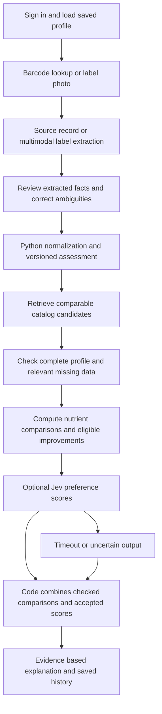

# TypeSafe Jev integration proposal

> Status: superseded — kept for provenance; current behaviour lives in `backend/README.md`. Banner added 2026-09-26; the live adapter was built and a bounded live contract check passed on 2026-09-26 (see `backend/scripts/provider-live-verification.md`).

## Decision

Use Jev for bounded semantic decisions inside FastAPI. The strongest first use is preference ranking of already assessed packaged-product replacements. A multimodal generative model handles label-photo extraction; Python handles restrictions, units, arithmetic, eligibility, and missing-data behavior. Templates can explain findings, with an optional generative model for grounded wording.

This extends the existing plan rather than replacing its assessment engine. Broad illness support still requires applicable evidence packs and explicit personal restrictions. A model does not supply missing clinical context by being given a disease name.

## What the documentation establishes

Jev evaluates supplied state using three question types. Choice selects among defined options; Score rates an ordered descriptive rubric; Noul returns a yes/no probability. Several independent questions can share one request. This is useful for software decisions with bounded outputs. [Introduction](https://docs.typesafe.ai/introduction)

State can be text or structured JSON. Images, audio, and video are not currently supported. Convert photographed labels to text/fields first. English is the primary supported training language; evaluate mixed-language Indian labels separately rather than assume equivalent performance. [State](https://docs.typesafe.ai/concepts/state)

Choice and Score include distributions and a derived confidence statistic. Noul has no separate confidence field. Those signals can route ambiguous semantic decisions to fallback, but are not measurements of a patient's probability of harm or proof that label data is correct. Thresholds require task-specific evaluation. [Confidence](https://docs.typesafe.ai/confidence)

The documented model is `jev-1.13.0`; `jev-latest` currently resolves to it. Published pricing is $0.042 per million input tokens, with free output tokens. Limits include 64k total tokens and 32k for state plus the longest question. Listed rate limits are expressly changeable. Pin a tested version for the demo and record the actual response model. Account access, credit/payment requirements, and our observed latency remain unverified. [Models](https://docs.typesafe.ai/models)

The provider documents limitations with arithmetic, literal wording, long irrelevant state, adversarial content, and multi-step indirection. It recommends code for numeric operations and a generative model for free-form extraction/generation. Therefore Jev must not calculate nutrient quantities, infer unknown amounts, or generate new product records. Its fast-response positioning is not a measured latency guarantee for this app. [Known limitations](https://docs.typesafe.ai/model-jaggedness/jev-1.13)

## Where it belongs

| Task | Proposed Jev primitive | Application behavior |
| --- | --- | --- |
| Map an unfamiliar product description to a supported category | Choice over known category IDs plus `unknown` | Suggest a category; do not silently overwrite a curated category |
| Interpret a search request | Choice over supported intents, such as product search, replacements, or guide | Route to the corresponding handler; retain explicit navigation as fallback |
| Classify an ambiguous advisory phrase | Choice: declared ingredient / precautionary advisory / marketing claim / unknown | Assist review; preserve raw phrase and unresolved status until confirmed |
| Judge how closely an eligible replacement matches a stated flavor preference | Score with three descriptive levels | Optional secondary ordering of candidates |
| Judge practical use similarity within a coarse comparison category | Score with explicit use descriptions | Help rank; cannot bypass the comparable-category requirement |
| Check whether an explanation is supported by supplied findings | Noul or Choice with insufficient-evidence option | Additional diagnostic only; actual claims/IDs still checked in code |

Implement replacement preference scoring first. Add category/intent routing only if it resolves a demonstrated problem. Advisory classification is optional and must not decide allergen absence. Do not add multiple model features just to use all three primitives.

## End-to-end request flow



An ineligible candidate is removed before the Jev request. Unknown information relevant to a required check prevents a completed suitability claim. Results can explicitly explain why no candidate qualifies. Flavor preference can never compensate for a recorded allergen conflict.

Preserve ranking priorities: first eligible improvements satisfying the selected comparison objective, then nutrient ordering computed on compatible bases, then optional semantic preference tie-breaking. Avoid a global weighted “health score” that allows one nutrient improvement to hide a new conflict or deterioration in another recorded objective.

Jev's composite-scoring pattern supports separate judgments combined by code. Use it only for preference dimensions after clinical/restriction gates. Keep the nutrient order and eligibility independent of that composite. [Composite scoring](https://docs.typesafe.ai/patterns/composite-scoring)

## Concrete request design

Illustrative fixture only: these are invented candidate IDs and descriptions, not verified products or actual API results. Assume both candidates have already passed the backend's supported applicable checks and improvement criteria.

```json
{
  "model": "jev-1.13.0",
  "state": {
    "preference": "I prefer plain, mild crackers to strongly seasoned crackers.",
    "candidates": {
      "demo_plain": {"description": "Plain crackers"},
      "demo_herbed": {"description": "Strongly herb-seasoned crackers"}
    }
  },
  "questions": {
    "plain_preference_fit": {
      "type": "score",
      "instructions": "Using only the supplied descriptions, rate how well candidates.demo_plain matches preference. Evaluate flavor preference only.",
      "criteria": [
        "Clearly conflicts with the stated flavor preference",
        "Partially matches or the description is insufficient",
        "Clearly matches the stated flavor preference"
      ]
    },
    "herbed_preference_fit": {
      "type": "score",
      "instructions": "Using only the supplied descriptions, rate how well candidates.demo_herbed matches preference. Evaluate flavor preference only.",
      "criteria": [
        "Clearly conflicts with the stated flavor preference",
        "Partially matches or the description is insufficient",
        "Clearly matches the stated flavor preference"
      ]
    }
  }
}
```

Question IDs are response keys, not model instructions; name the actual candidate path in each instruction. A three-level Score ranges from 0 to 2 and can be fractional. Normalize by two only for preference ordering; it is not a safety percentage. [HTTP API](https://docs.typesafe.ai/api), [Score semantics](https://docs.typesafe.ai/primitives/score)

Generate one explicit question per candidate/dimension, with at most five retrieved eligible candidates and one or two dimensions initially. Send only relevant descriptions, preferences, and computed facts. Multiple questions are independent: a question cannot consume another question's answer within the same call. Any dependent stage requires a separate call or code.

For uncertainty, use an explicit `unknown` option with Choice. A low-confidence Score must fall back to deterministic ordering. Do not interpret high confidence as sufficient evidence where source fields are absent. If ingredient interpretation suggests a novel alias, save it as an unconfirmed proposal rather than automatically changing the active dictionary.

## FastAPI and PostgreSQL integration

Use `typesafe-sdk` with `AsyncTypeSafeClient`, configured on the backend through `TYPESAFE_API_KEY` and a pinned model. The SDK supports timeout/retry configuration. Create and close a shared client through FastAPI's lifecycle; do not instantiate synchronous network calls inside an async request handler. The documented SDK may log request/response bodies, so leave body logging disabled for personal data. [Python asynchronous client](https://docs.typesafe.ai/sdk/python/api/clients/async)

The service boundary is `score_candidate_preferences(eligible_candidates, preferences)`. It returns candidate IDs, accepted preference scores, uncertainty/fallback status, model version, and duration. It receives no email, access token, user password, or unrelated illness history. No new public model endpoint is necessary: the existing owned `POST /api/recommendations` orchestrates it.

Persist the candidate snapshots and final order in the existing `recommendation_runs` table. Its JSONB metadata can include `ranking_method`, `model`, `prompt_version`, `rubric_version`, `preference_scores`, `duration_ms`, and `fallback_reason`. Store only what is needed to reproduce the recommendation; do not duplicate secrets or full SDK logs. Persist the extraction model/version separately in the assessment's observation metadata.

Propose a five-second total wall-clock budget for optional ranking, including any retry. This is our UX design target, not vendor performance evidence. Bound SDK retries within that total budget; skip ranking on authentication/configuration failures. Validate expected question IDs, types, finite score ranges, distributions, and candidate membership. A failed ranking call returns the same checked candidates using deterministic order.

Do not hold a PostgreSQL transaction open during model inference. Load an owned assessment snapshot and candidate versions, release the transaction, perform model scoring, then save the recommendation with version checks. A profile change invalidates the current request's applicability; require reassessment rather than presenting old constraints as current.

The provider API uses bearer authentication at `POST https://api.typesafe.ai/v1/systemone`. It documents validation, authorization, rate-limit, and overload errors. Handle these as optional-ranking failures with a usable result. [API and errors](https://docs.typesafe.ai/api)

## Evaluation and the 24-hour build

Person C owns candidate filtering, numeric comparison, deterministic ranking, Jev rubrics, and evaluation cases. Person B owns the asynchronous provider adapter, timeout/configuration, and persisted metadata. Person D prepares actual labeled candidate records and ambiguous/adversarial fixtures. Person A renders understandable comparisons and graceful fallback states.

Proposed sequence:

1. Hours 0–2: settle the observation/restriction contracts and prepare comparison categories. Verify provider account/API access if available; do not make it a prerequisite for initial backend work.
2. By hour 8: sign-in, saved profile, owned assessment, deterministic eligible replacements, and persistence work together.
3. Hours 8–12: add one Jev preference-scoring adapter and a multimodal label parser in parallel team work, through the agreed contracts.
4. By hour 14: compare model-assisted behavior against deterministic baseline; stop expanding integrations.
5. Hours 14–21: correct observed errors, rehearse missing-data/provider-failure cases, and finalize the guide and comparisons.
6. Hours 21–24: freeze features and demonstrate the complete mobile/web paths.

Use a small reviewed evaluation set covering plain/mild preferences, unknown category, compound advisories, mixed language, negation, missing fields, label text that tries to change instructions, conflicting restrictions, and unavailable API. Record wrong preference/category decisions, fallback frequency, and actual median/tail latency. Medical gates must produce the same eligibility with Jev enabled and disabled.

Proceed with model assistance only where the observed results justify it. A working end-to-end app must retain manual correction and deterministic assessment/replacements when external inference is unavailable. This proposal does not claim Jev has been validated for clinical decisions.
